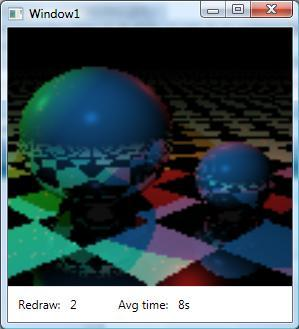

# ObticsRaytracer

**!Disclaimer!**
This small application, which is code demonstration, is not an example of how Obtics **should** be used. Same as that Luke Hoban's "Raytracer in one line LINQ code" is not a demonsration of how LINQ should be used. There are far better ways of implementing a raytracer that updates it result when the scene changes, than through Obtics or LINQ. The point of this demonstration is that it is possible to do. And for fun naturaly :-)

**Credits**
ObticsRaytracer is based on Luke Hoban's "Raytracer in one line LINQ code", which can be found here: [http://blogs.msdn.com/lukeh/archive/2007/10/01/taking-linq-to-objects-to-extremes-a-fully-linqified-raytracer.aspx](http://blogs.msdn.com/lukeh/archive/2007/10/01/taking-linq-to-objects-to-extremes-a-fully-linqified-raytracer.aspx)

**What it does**
ObticsRaytracer creates an image out of a 3d scene and does so via 2 LINQ statements. The position and color of the lights have been made observable and the LINQ statements have been passed through the Obtics ExpressionObserver. The result is that the image automatically redraws itself whenever the color or position of a light changes. When the original image has been painted the application starts a loop and randonly changes the position or color of a light with each iteration. It shows a count of the number of changes and the average time it took to completely redraw the image. The time it takes to redraw depends on the change; which pixels are influenced by it and via how many rays. This demonstrations shows that Obtics can handle complex (LINQ) queries, is thread safe and parallelization ready.

**Parallelization**
To speed things up a bit and for demonstration reasons the application uses the 'Parallel Extension' library. You can download it here: [http://www.microsoft.com/downloads/details.aspx?FamilyId=348F73FD-593D-4B3C-B055-694C50D2B0F3](http://www.microsoft.com/downloads/details.aspx?FamilyId=348F73FD-593D-4B3C-B055-694C50D2B0F3)
This proves that Obtics is thread safe and getting 'parallel ready'.

**The core**
In ObticsRaytracer the "one line LINQ" (which is an almost true statement) is split in two. The reason is that the original LINQ statement contained an inner lambda passed to a custom function. For the ExpressionObserver inner lambdas form an observablity boundary. It doesn't know how the inner lambda is being used by the custom function so it doesn't make any assumptions. The mentioned inner lambda therefore is passed to the ExpressionObserver seperately.

The core of the demo is formed by these pieces of code:
{{
        static Func<Func<TraceRayArgs, IValueProvider<Color>>,TraceRayArgs, IValueProvider<Color>> _ComputeTraceRayF =
            ExpressionObserver.Compile(
                (Func<TraceRayArgs, IValueProvider<Color>> f, TraceRayArgs traceRayArgs) =>
                         (from isect in
                            (
                              from thing in traceRayArgs.Scene.Things
                              let iisect = thing.Intersect(traceRayArgs.Ray)
                              where iisect != null
                              orderby iisect.Dist
                              select iisect
                            ).Take(1)
                          let d = isect.Ray.Dir
                          let pos = Vector.Plus(Vector.Times(isect.Dist, isect.Ray.Dir), isect.Ray.Start)
                          let normal = isect.Thing.Normal(pos)
                          let reflectDir = Vector.Minus(d, Vector.Times(2 * Vector.Dot(normal, d), normal))
                          let naturalColors =
                              from light in traceRayArgs.Scene.Lights
                              let ldis = Vector.Minus(light.Pos.Value, pos)
                              let livec = Vector.Norm(ldis)
                              let testIsect = 
                                 (
                                     from thing in traceRayArgs.Scene.Things
                                     select thing.Intersect(new Ray() { Start = pos, Dir = livec })
                                 ).Aggregate(
                                     null, 
                                     (ISect closest,ISect inter) => 
                                         closest == null || inter != null && inter.Dist < closest.Dist ? inter : closest
                                )
                              where testIsect == null || testIsect.Dist > Vector.Mag(ldis) //!isInShadow
                              let illum = Vector.Dot(livec, normal)
                              let lcolor = illum > 0 ? Color.Times(illum, light.Color.Value) : Color.Make(0, 0, 0)
                              let specular = Vector.Dot(livec, Vector.Norm(reflectDir))
                              let scolor = 
                                specular > 0
                                    ? Color.Times(
                                        Math.Pow(specular, isect.Thing.Surface.Roughness),
                                        light.Color.Value
                                    )
                                    : Color.Make(0, 0, 0)
                              select 
                                Color.Plus(
                                    Color.Times(isect.Thing.Surface.Diffuse(pos), lcolor),
                                    Color.Times(isect.Thing.Surface.Specular(pos), scolor)
                                )
                          let reflectPos = Vector.Plus(pos, Vector.Times(.001, reflectDir))
                          let reflectColor =
                                traceRayArgs.Depth >= MaxDepth
                                      ? Color.Make(.5, .5, .5)
                                      : Color.Times(
                                            isect.Thing.Surface.Reflect(reflectPos),
                                            f(
                                                new TraceRayArgs(
                                                    new Ray()
                                                    {
                                                        Start = reflectPos,
                                                        Dir = reflectDir
                                                    },
                                                    traceRayArgs.Scene,
                                                    traceRayArgs.Depth + 1
                                                )
                                            ).Value
                                        )
                                                
                          select
                            naturalColors.Aggregate(
                                reflectColor,
                                (color, natColor) => Color.Plus(color, natColor)
                            )
                         ).DefaultIfEmpty(Color.Background).First()
            );

        static Func<RayTracer, Scene, IValueProvider<IEnumerable<IEnumerable<Pixel>>>> BuildPixelsQuery =
            ExpressionObserver.Compile(
                (RayTracer t, Scene scene) =>
                    from y in Enumerable.Range(0,t.screenHeight).Reverse()
                    let recenterY = -(y - (t.screenHeight / 2.0)) / (2.0 * t.screenHeight)
                    select 
                        from x in Enumerable.Range(0, t.screenWidth)
                        let recenterX = (x - (t.screenWidth / 2.0)) / (2.0 * t.screenWidth)                       
                        select 
                            new Pixel { 
                                X = x, 
                                Y = y, 
                                Color = 
                                    Y(
                                        (Func<Func<TraceRayArgs, IValueProvider<Color>>, Func<TraceRayArgs, IValueProvider<Color>>>) (
                                            f => traceRayArgs =>
                                                _ComputeTraceRayF(f, traceRayArgs)
                                        )
                                    )( 
                                        new TraceRayArgs(
                                            new Ray() { 
                                                Start = scene.Camera.Pos, 
                                                Dir = 
                                                    Vector.Norm(
                                                        Vector.Plus(
                                                            scene.Camera.Forward,
                                                            Vector.Plus( 
                                                                Vector.Times(recenterX, scene.Camera.Right),
                                                                Vector.Times(recenterY, scene.Camera.Up)
                                                            )
                                                        )
                                                    ) 
                                            }, 
                                            scene, 
                                            0
                                        )
                                    ) 
                            }
            );

        object _Pixels;

        internal void Render(Scene scene)
        {
            var pixelsQuery = BuildPixelsQuery(this,scene).Cascade();

            var pixels = new IValueProvider<Color>[screenWidth, screenHeight](screenWidth,-screenHeight);

            Parallel.ForEach(
                pixelsQuery.SelectMany(row => row),
                pixel =>
                {
                    var colorProvider = pixel.Color;
                    var px = pixel.X;
                    var py = pixel.Y;

                    pixels[px, py](px,-py) = colorProvider;
                    var npc = colorProvider as INotifyPropertyChanged;

                    if (npc != null)
                        npc.PropertyChanged += delegate(object sender, PropertyChangedEventArgs args)
                        {
                            if (args.PropertyName == "Value")
                                setPixel(px, py, colorProvider.Value.ToDrawingColor());
                        };

                    setPixel(px, py, colorProvider.Value.ToDrawingColor());
                }
            );

            _Pixels = pixels;            
        }

}}

The original Light class has been replace with the following:
{{

    //class Light
    //{
    //    public Vector Pos;
    //    public Color Color;
    //}

    class Light
    {
        public IValueProvider<Vector> Pos;
        public IValueProvider<Color> Color;
    }

}}
The original fields are replaced with fields that hold ValueProviders. It is also possible to replace the original fields with properties and implement INotifyPropertyChanged on the Light class itself.

And they are initialized like so:
{{

                new Light() {
                    Pos = ValueProvider.Dynamic(Vector.Make(-2,2.5,0)),
                    Color = ValueProvider.Dynamic(Color.Make(.49,.07,.07))
                }

}}
ValueProvider.Dynamic supplies a value container with a mutable Value property and an INotifyPropertyChanged implementation.

Now when the raytracer has finished rendering (or before) and the color of a light is changed; all pixels with a dependency on that light's color are recalculated and redrawn:
{{

              RayTracer.DefaultScene.Lights[2](2).Color.Value = Color.Make(.07,.49,.29);

}}

**Performance**
Note that the _ComputeTraceRayF function may be called many times per pixel. The exact number of times depends on each individual pixel (if a ray through that pixel intersects with anything or not). This means that a large to hughe transformation pipeline is generated for each of the 10,000 pixels. This means that the result is not exactly lightning fast and the application will claim an enormous chunk of working memory (about 1G). Be aware that this a technology demonstration and not a guideline of how to build a raytracer.

In this demonstration 'only' the color and position of the lights are changed. Future versions may become even more dynamic.